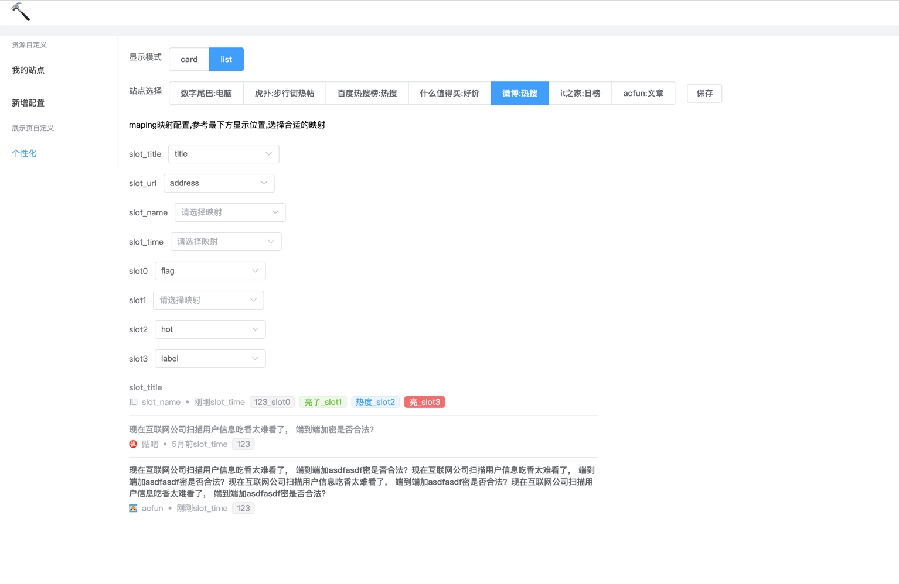
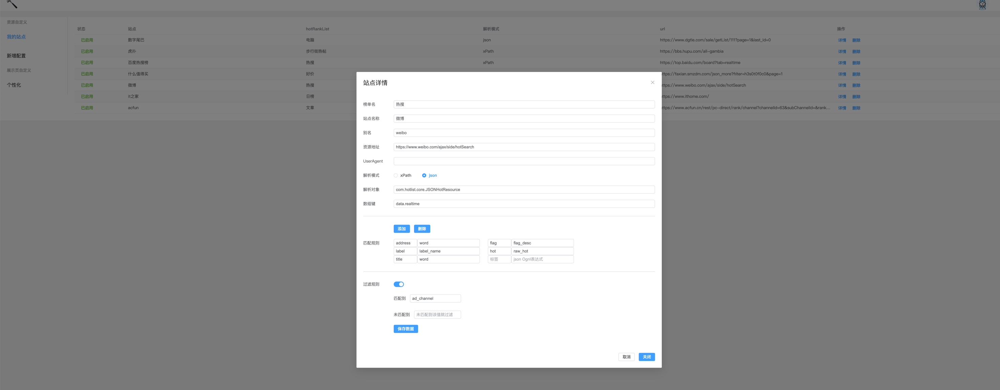
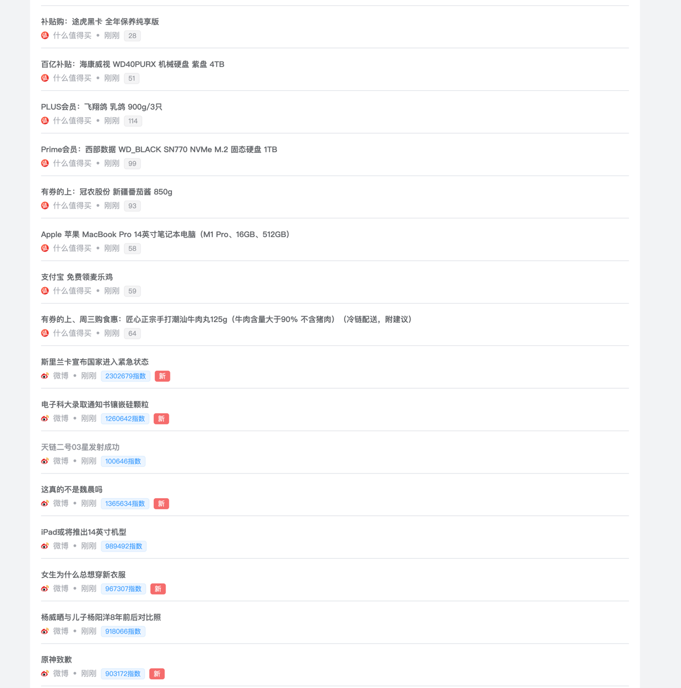
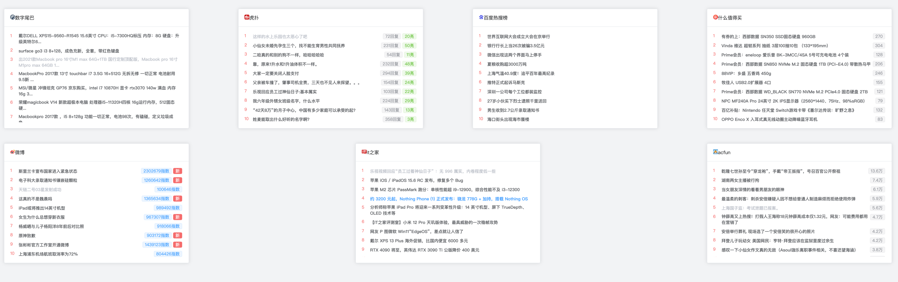

# 该站点是一个获取各大热门网站资源的聚合网站
> 本人经常看今日热榜，和一些其他的站点，但是想看些其他内容，随做了一个可自定义的站点。
> 等待后续继续提交代码完善项目。

## 技术栈
* 数据库：使用了redis作为数据库。（目前做了一半，感觉扩展性太差，后续考虑用MongoDB）
* 前端：vue3+Element。挺简单的界面但真的做了好久，真就后端十分钟，前端两小时。

## 使用说明
### nginx映射
```
location / {
	    proxy_pass   http://localhost:9000;  #后端地址
	    proxy_set_header	Host		$host; 
        }

	location /api/ {
        proxy_pass   		http://localhost:8081/; #前端地址
		proxy_redirect		off; # 关闭重定向
		proxy_set_header	Host	$host; #设置请求头host
		proxy_set_header	X-Real-IP	$remote_addr; #设置请求ip
		proxy_set_header	X-Forwarded-For	  $proxy_add_x_forwarded_for;
	}
```
### 数据库
* hash键名：hot:site:xin
* 表中存放下面json，键名：weibo:热搜:default:pc
```json
{
  "alias": "weibo",
  "arrayKey": "data.realtime",
  "available": true,
  "hotRankList": "热搜",
  "hotRankListCategory": {
    "hotRankListCategory": "default"
  },
  "parseBean": "com.hotlist.core.JSONHotResource",
  "parseContent": {
    "address": "word",
    "flag": "flag_desc",
    "label": "label_name",
    "hot": "raw_hot",
    "title": "word"
  },
  "parseType": "json",
  "serializeFilterRuler": {
    "excludeMap": {

    },
    "hasKey": "ad_channel"
  },
  "showConfig": {
    "config": {
      "address": "https://s.weibo.com/weibo?q=[address]",
      "hot": "[hot]指数"
    },
    "pageMappingConfig": {
      "slot_title": "title",
      "slot_url": "address",
      "slot0": "flag",
      "slot2": "hot",
      "slot3": "label"
    }
  },
  "siteName": "微博",
  "url": "https://www.weibo.com/ajax/side/hotSearch"
}
```
* 用户hash键：hot:user
* 随便设置一个用户。键为xin，值复制下面对象
```json
{
  "password": "$2a$10$c.vDP8q3Ze5bHW3WYbHX.uvAxUiTSkf2Wpd0bbjv1vukdqiogh1qG",
  "showSchema": "list",
  "userName": "xin"
}
```
### 前端
* copy直接npm run dev
## 界面
* 站点个性化



